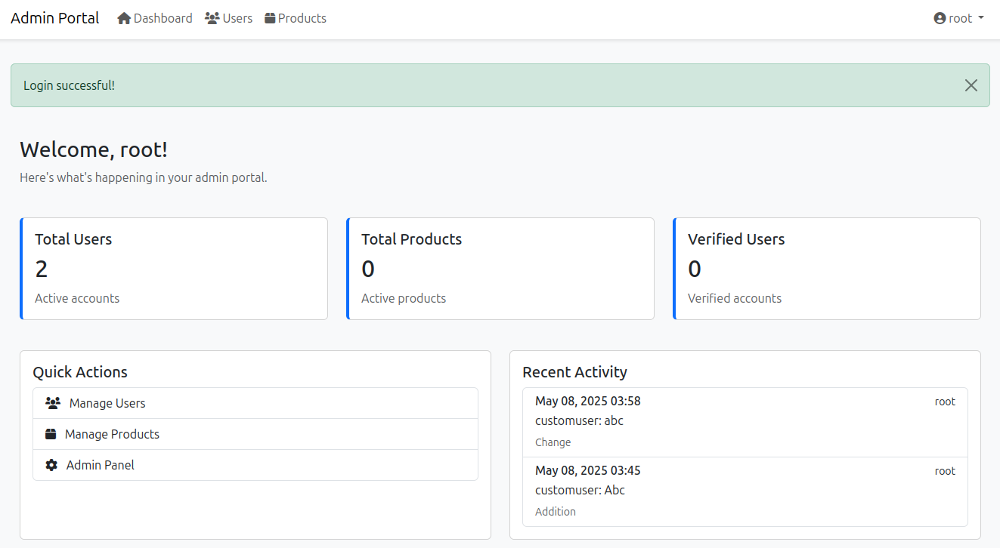

# Django Admin Portal

A modern Django admin portal with custom user management, dashboard, and authentication system.

<p align="center"></p>

## Features

- **Custom User Model**
  - Extended Django's AbstractUser
  - Additional fields: phone number, address, birth date, profile picture
  - User verification system
  - Timestamps for creation and updates

- **Authentication System**
  - Custom login page with Bootstrap styling
  - API-based authentication support
  - Automatic redirection to dashboard for logged-in users
  - Secure logout functionality
  - CSRF protection

- **Dashboard**
  - Modern, responsive design
  - Statistics cards showing:
    - Total users
    - Total products
    - Verified users
  - Quick action links for admin users
  - Recent activity log
  - Role-based access control

- **Admin Interface**
  - Custom admin views for User and Product models
  - Role-based access control
  - Filtered views for non-staff users
  - Activity logging

## Project Structure

```
├── admin_app/
│   ├── templates/
│   │   └── admin_app/
│   │       ├── base.html
│   │       ├── login.html
│   │       └── index.html
│   ├── models.py
│   ├── views.py
│   ├── urls.py
│   └── admin.py
├── admin_page/
│   ├── settings.py
│   └── urls.py
├── requirements.txt
└── manage.py
```

## Setup Instructions

1. Create a virtual environment:
```bash
python -m venv .venv
```

2. Activate the virtual environment:
- On Windows:
```bash
.venv\Scripts\activate
```
- On Unix or MacOS:
```bash
source .venv/bin/activate
```

3. Install dependencies:
```bash
pip install -r requirements.txt
```

4. Run migrations:
```bash
python manage.py makemigrations
python manage.py migrate
```

5. Create a superuser (admin):
```bash
python manage.py createsuperuser
```

6. Run the development server:
```bash
python manage.py runserver
```

## URLs

- Login Page: `http://127.0.0.1:8000/api/login/`
- Dashboard: `http://127.0.0.1:8000/api/dashboard/`
- Admin Interface: `http://127.0.0.1:8000/admin/`

## Security Features

- CSRF protection
- Role-based access control
- Secure password handling
- Protected admin routes
- Session management

## Dependencies

- Django == 5.2.1
- Pillow == 11.2.1 (for image handling)

## Development

The project uses:
- Bootstrap 5 for styling
- Font Awesome for icons
- Django's built-in authentication system
- Custom user model
- Template inheritance
- Class-based views

## Development Environment

This project is developed using:
- **IDE**: Cursor - A modern AI-powered code editor
- **Operating System**: Linux 6.8.0-59-generic
- **Shell**: Bash (/usr/bin/bash)

## Contributing

1. Fork the repository
2. Create a feature branch
3. Commit your changes
4. Push to the branch
5. Create a Pull Request 